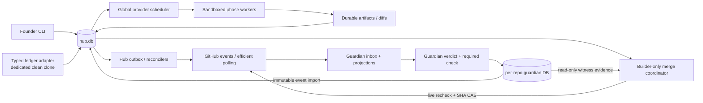

# Builder Programme Design Audit

- **Audited plan:** [`2026-08-21-builder-design.md`](./2026-08-21-builder-design.md)
- **Codebase:** `revnix/reeve` at `b1ad0b7124328dabd39dd10c877c697b6e6a80f1`
- **Audit date:** 2026-08-21
- **Scope:** current Reeve implementation, the proposed builder design, the live Nextly GitHub/App/ruleset boundary, the live nextly-ops ledger implementation, the installed Claude Code runtime, recovery/backup behavior, developer/operator experience, and current primary-source guidance.

## Executive verdict

**Do not implement the plan unchanged.** The direction is strong, but the document is not yet an implementation-safe “final design.” I recommend approving the builder programme in principle, reopening this design for one amendment, and withholding every autonomous merge capability until the P0 items in this audit are closed with live evidence.

My honest score:

| Dimension | Score | Why |
|---|---:|---|
| Architectural direction | 8/10 | A separate builder process, deterministic phases, durable evidence, outbox effects, SHA-bound approval, and independent witnesses are the right foundations. |
| Implementation readiness | 4/10 | Several stated guarantees cannot be implemented by the proposed ownership and schema model. Some current-code reuse claims are false. |
| Operational safety today | 3/10 | The live server gate does not require Reeve's verdict; the planned activation flag is already enabled in the live profile; worker containment is not OS-enforced; cancellation and merge effects live in different stores. |
| DX potential | 8/10 | The one-task/one-status/one-next-action interface can be excellent after the protocol and ownership seams are simplified. |

The most important conclusion is architectural:

> The hub must own builder task state, builder effect intents, cancellation, approvals, and builder-only merge intents. The guardian should remain the independent PR observer/repairer and publish its evidence from its own store. It should not own builder merge intent, and no logical transition should require an atomic write to both SQLite databases.

This change removes the worst cancellation race, avoids an impossible WAL cross-database atomicity promise, and keeps the actor/witness separation intact.

## What I verified

This is not a document-only review.

### Repository and tests

- Local `main` and `origin/main` were both at `b1ad0b7124328dabd39dd10c877c697b6e6a80f1`; the worktree was clean before this audit artifact was added.
- The complete current suite passed on the required Node `v24.17.0`: 47 test files.
- The same 47 files passed under `TZ=UTC`, `TZ=Asia/Karachi`, and `TZ=America/Los_Angeles` (141 file executions).
- The latest remote CI run for the audited head was also successful: [Reeve CI run 32497994491](https://github.com/revnix/reeve/actions/runs/32497994491).

That proves the current guardian behavior is well tested. It does **not** prove the proposed builder protocol, which does not exist yet and introduces new cross-process, cross-store, and live-server boundaries.

### Current Reeve behavior

- The guardian loop computes apparent capacity but awaits each dispatched worker inline; `ctx.running` is not maintained. A second builder process is therefore justified ([`src/daemon.mjs` lines 359-365 and 445-458](../src/daemon.mjs#L359-L458)).
- A durable run is created before spawn, but heartbeat failure is swallowed and does not stop a worker ([`src/daemon.mjs` lines 416-458](../src/daemon.mjs#L416-L458)).
- `runWorker` inherits the full parent environment, buffers stdout/stderr in memory, and deliberately swallows `onSpawn` failure ([`src/supervisor.mjs` lines 204-259](../src/supervisor.mjs#L204-L259)). Those semantics are unsafe for a long-lived autonomous builder without a new fail-closed lease contract.
- Current sandbox enforcement is mostly Claude tool-policy string matching plus a bogus worktree push URL. The code itself documents the `git -C` matcher weakness ([`src/sandbox.mjs` lines 61-70 and 152-170](../src/sandbox.mjs#L61-L170); [`src/worktree.mjs` lines 117-134](../src/worktree.mjs#L117-L134)).
- The controller, not the worker, performs current pushes, which is a sound separation ([`src/daemon.mjs` lines 518-542](../src/daemon.mjs#L518-L542); [`src/worktree.mjs` lines 198-229](../src/worktree.mjs#L198-L229)).
- The existing outbox is strict and useful, but it has no `task_id`, generation/fencing field, or `voided` status. Expired `inflight` rows are simply returned to `pending`; reconciliation is not invoked by that operation ([`src/db/schema.sql` lines 107-130](../src/db/schema.sql#L107-L130); [`src/db/ops.mjs` lines 228-274](../src/db/ops.mjs#L228-L274)).
- Reconcilers exist for push, PR create, comments, and merge, but they currently have no drainer caller ([`src/db/reconcile.mjs`](../src/db/reconcile.mjs)).
- Existing schema quality is materially stronger than the proposed builder DDL: `STRICT`, foreign keys, status checks, `WITHOUT ROWID`, and partial unique indexes are already normal practice ([`src/db/schema.sql` lines 1-20 and 54-130](../src/db/schema.sql#L1-L130)).
- Backup discovery only scans `~/.reeve/state/<owner>/*.db`; a proposed `~/.reeve/state/hub.db` is invisible. Restore validates snapshots by querying an `event` table, which the proposed hub schema does not have ([`src/backup.mjs` lines 60-109 and 121-142](../src/backup.mjs#L60-L142)).
- Profile loading refuses unknown keys, as the plan correctly notes ([`src/profile/schema.mjs` lines 296-306](../src/profile/schema.mjs#L296-L306)).

### Live Nextly enforcement boundary

I queried the live API as part of this audit.

- The `merge-policy` GitHub App authenticated successfully against both `nextlyhq/nextly` and private `nextlyhq/nextly-ops`, installation `155196718`.
- Its installation token currently carries the intended permissions: Actions read, Administration read, Checks write, Contents write, Issues write, Metadata read, Pull requests write, and Statuses write. The code deliberately refuses Administration write ([`src/github/app.mjs` lines 97-139](../src/github/app.mjs#L97-L139)).
- The active `protect-main` ruleset requires a pull request, one approval, code-owner review, and an extra approval for unattributed changes. Its only bypass actor is Organization Admin; the App is not a bypass actor.
- Branch protection currently requires only `Decide what this commit can affect`. It does **not** require Reeve's `ops/merge-policy` check and does not bind that check to the Reeve App.
- The live sidecar profile already says `authority.permission: admin`, `authority.policy: propose_and_merge`, and `merge.enforcement: enforced`. The launchd job remains non-actuating because it has neither `--execute` nor `--enforce`.

These facts invalidate two rollout assumptions:

1. The plan says the merge executor can be dark behind `authority: propose_and_merge`, “which no profile yet sets,” and that PR 10 will flip that authority ([plan lines 450-461](./2026-08-21-builder-design.md#L450-L461)). The live Nextly profile already sets it.
2. The plan says no external prerequisite remains before rollout ([plan line 450](./2026-08-21-builder-design.md#L450)). In reality, GitHub will refuse the first unattended merge for lack of human/code-owner approval, while GitHub itself does not require the Reeve verdict that is supposed to be the authoritative safety boundary.

### Live ledger implementation

I audited the authoritative checkout at `/Users/mobeen/Work/Products/nextly-workspace/nextly-ops`, head `ce9606d5aa2c179ca610c6f8c543272213076570`. It was already dirty with a modified ledger and two untracked handoff documents; I did not mutate it.

- `claim` is a read/check/append sequence. Projection applies the last claim unconditionally; `release` clears the current owner unconditionally ([`plugins/agent-ops/bin/ledger` lines 91-113 and 190-209](../../nextly-workspace/nextly-ops/plugins/agent-ops/bin/ledger#L91-L209)).
- Ledger events have no operation ID or idempotency key. The plan's byte-offset identity is unstable across rebase/conflict repair.
- The plan's note command is syntactically wrong. The CLI accepts `ledger note <text> [--node <id>]`, not `ledger note <id> <text>` ([ledger lines 254-263](../../nextly-workspace/nextly-ops/plugins/agent-ops/bin/ledger#L254-L263)).
- The proposed final `add pr:N` write-back omits required `--kind` and `--title` arguments.
- `ledger sync` runs `pull --rebase --autostash`, stages all `ledgers` and `decisions`, commits, and pushes ([ledger lines 329-348](../../nextly-workspace/nextly-ops/plugins/agent-ops/bin/ledger#L329-L348)). Running this from a human's dirty working clone can commit unrelated work.
- `flock` is not installed on this macOS host, and Node 24 exposes neither `fs.flock` nor `fs.flockSync`. The plan relies on `flock` for both builder singleton and ledger serialization ([plan lines 27 and 61-73](./2026-08-21-builder-design.md#L27-L73)). That design is not executable on the target host as written.

### Installed Claude Code runtime

- Installed Claude Code is `2.1.237`.
- It supports `--agents`, `--effort`, `--max-budget-usd`, `--json-schema`, `--safe-mode`, `--strict-mcp-config`, and `--no-chrome`.
- `--print` silently ignores a settings file that fails validation. Reeve therefore cannot treat “the settings path was supplied” as proof that the sandbox applied.
- The current user settings contain broad Git/GitHub permissions, plugins, extra directories, and no native `sandbox` block. A builder must not inherit these ambient settings.
- `--bare` would provide the cleanest configuration boundary, but this installed version explicitly disables OAuth/keychain authentication in bare mode. Because the settled design uses the founder's Claude subscription rather than an API key, `--bare` cannot simply be adopted without first proving a separate supported authentication path.

## What the plan gets right

These are important strengths worth preserving.

1. **A sibling builder daemon is correct.** The current guardian's inline await makes putting hour-long implementation phases inside it unacceptable ([plan lines 23-33](./2026-08-21-builder-design.md#L23-L33)).
2. **The deterministic state machine is the right control plane.** Workers produce bounded artifacts; code owns transitions; absence and UNKNOWN never become success ([plan lines 85-124](./2026-08-21-builder-design.md#L85-L124)).
3. **Durable artifacts and external-truth reconcilers are right.** Recovery should reconstruct from SQLite, git, and GitHub rather than a model conversation or process memory.
4. **The spec gate is properly head-bound.** Mandatory Codex clean plus explicit SHA-bound founder approval/silence logic is substantially safer than pre-authorization or a prose-only gate ([plan lines 223-257](./2026-08-21-builder-design.md#L223-L257)).
5. **The actor is not the witness.** Workers create code; deterministic checks, CI, reviewers, git history, and GitHub protection judge it.
6. **Worktree separation and controller-owned publication are right.** Per-task/slice worktrees and App-owned pushes constrain collision and attribution.
7. **The plan takes failure states seriously.** BLOCKED, ESCALATED, LOST, INFEASIBLE, and crash recovery are explicitly modeled instead of hidden in logs.
8. **Capability-last rollout is the correct instinct.** The merge actuator should soak in shadow mode before it receives authority, even though the proposed switch and prerequisites need correction.
9. **Rule 15 is treated as an effect-time concern.** Rechecking private visibility immediately before private-spec effects is the right shape, although caching and lint scope should change.
10. **Small, reviewable slices are a good default.** The measured relationship between large diffs and review rounds should inform planning, just not become an inflexible ten-file invariant.

## P0 blockers: resolve before implementation is authorized against this design

### P0-1 — The live server is not the authoritative gate, and the proposed dark flag is already on

**Plan claim.** The guardian will own a general merge executor, ordinary PRs will merge on U1-U4, and builder PRs will add B1-B6. The executor lands dark behind `authority: propose_and_merge`, then rollout PR 10 flips authority ([merge design, plan lines 280-310](./2026-08-21-builder-design.md#L280-L310); [rollout, plan lines 448-461](./2026-08-21-builder-design.md#L448-L461)).

**Finding.** Three separate problems are coupled here:

- The profile flag is already enabled, so it is not a dark capability boundary.
- The current GitHub rules do not require Reeve's verdict from the Reeve App. A local check can therefore be bypassed by any actor with another allowed merge path.
- “Ordinary PRs merge on universal clauses” silently expands the settled requirement from builder PRs to every PASS PR in a watched repository. That is a separate and much larger authority decision.

GitHub supports requiring a status check from a specific App, and will refuse another source's status under that configuration ([GitHub ruleset documentation](https://docs.github.com/en/enterprise-cloud@latest/repositories/configuring-branches-and-merges-in-your-repository/managing-rulesets/available-rules-for-rulesets#require-status-checks-to-pass-before-merging)). That is the correct enforcement boundary.

**Recommendation.** Replace this plan section with all of the following:

1. Add an independent, default-false capability such as `builder.merge.enabled`, plus an explicit builder-run actuator flag. Do not reuse repository authority.
2. Make auto-merge structurally builder-only: an implementation PR must have a hub `impl_pr` binding and current task generation. Ordinary PRs continue receiving verdicts/checks but never auto-merge unless a later, separately approved programme authorizes that behavior.
3. Before any canary, require `ops/merge-policy` in the live ruleset and bind its expected source to the `merge-policy` App.
4. Decide explicitly whether human/code-owner approval remains required for implementation PRs. Keeping it is the right pilot posture, but it means the pilot is supervised rather than autonomous. Remove it only after the required Reeve check and escape-rate evidence are credible.
5. Add a live negative probe: publish a failing/UNKNOWN Reeve check on a disposable PR and prove the App cannot merge it. Unit tests and a dry-run are not sufficient evidence.

### P0-2 — Builder merge intent belongs in the hub, not the guardian DB

**Plan claim.** Cancellation voids hub outbox rows in the task transition, while the guardian's merge executor reads both stores, writes `merge_decision` in its per-repo DB, and enqueues the merge there ([transition design, plan lines 112-124](./2026-08-21-builder-design.md#L112-L124); [merge design, plan lines 280-306](./2026-08-21-builder-design.md#L280-L306)).

**Finding.** Cancellation and merge intent are in different transactions and different stores. The plan can void only pending **hub** effects. A guardian merge row may already be `inflight`. `--match-head-commit` protects the code SHA, but it does not protect a founder cancellation, reopened spec, expired ownership witness, or approval-generation change when the PR head itself has not moved.

The sentence “a cancelled task's already-enqueued ... merge must never fire” is therefore stronger than the proposed mechanism. The failure matrix tests cancellation followed by PASS, but not the dangerous ordering: merge leased first, cancellation committed second, GitHub call third.

**Recommendation.** Move the builder-only merge coordinator and `merge_decision`/merge outbox to `hub.db`:

- Guardian owns observation, repair, and publication of the head-bound `ops/merge-policy` check.
- Builder/hub owns task liveness, approval generation, cancellation, and builder merge intent.
- The hub merge coordinator reads the guardian's durable verdict evidence and live GitHub state, writes the decision and outbox in the same hub transaction as the current task generation, and acts only for a bound builder PR.
- Immediately before the API call, re-read the hub generation/cancellation state, guardian verdict at H, live GitHub state, and current ledger ownership. Then merge with GitHub's `sha` compare-and-swap. GitHub returns `409` when the supplied SHA no longer matches ([GitHub merge API](https://docs.github.com/en/rest/pulls/pulls#merge-a-pull-request)).
- Cancellation becomes `CANCELLING` until any leased external effect reconciles. It is not `CANCELLED` merely because pending rows were marked void.
- On cancel/reopen, publish a failing required Reeve check at H. The server then re-evaluates that authoritative condition at merge time even if a stale client request exists.

This preserves independent witnesses: the deterministic hub coordinator is an actuator, not the model; the guardian, CI, external reviewers, git, ledger, and GitHub remain witnesses.

### P0-3 — Do not build a logical transaction across two WAL databases

**Plan claim.** A guardian repair-push outbox settle appends `attested_push` to the hub, described as a narrow witnessed guardian-to-hub write ([implementation design, plan lines 265-274](./2026-08-21-builder-design.md#L265-L274); [guardian ownership, plan lines 434-442](./2026-08-21-builder-design.md#L434-L442)).

**Finding.** The guardian outbox result and hub attestation cannot be made crash-atomic. Even SQLite `ATTACH` does not solve this under WAL: SQLite documents that a crash during a multi-file commit can leave some database files committed and others not ([SQLite ATTACH documentation](https://www.sqlite.org/lang_attach.html)). The current Reeve schema explicitly uses WAL ([`src/db/schema.sql` line 4](../src/db/schema.sql#L4)).

**Recommendation.** Use one owner plus an idempotent projection:

- Guardian settles its repair push and appends a stable `guardian_event`/outbox receipt in its own per-repo transaction.
- Hub imports that immutable event using a unique source key such as `(repo_id, guardian_event_seq)` and reconciles the claimed SHA against the remote ref/git graph.
- Re-delivery is expected and harmless. Never claim exactly-once delivery; use at-least-once delivery with idempotent consumers. This is the normal transactional-outbox contract ([AWS transactional outbox guidance](https://docs.aws.amazon.com/prescriptive-guidance/latest/cloud-design-patterns/transactional-outbox.html)).
- A missing import blocks B1 as UNKNOWN. It does not make the push illegitimate, and the importer can recover it from guardian history.

### P0-4 — Worker containment must use the OS boundary and fail closed

**Plan claim.** An isolated HOME, cleared Git credentials, a pre-push hook, bogus push URL, and Claude deny rules make publication impossible ([plan lines 155-174](./2026-08-21-builder-design.md#L155-L174)).

**Finding.** This is necessary but incomplete.

- Current `runWorker` spreads `process.env`, which can include tokens, proxy settings, `SSH_AUTH_SOCK`, and other ambient authority ([`src/supervisor.mjs` lines 204-225](../src/supervisor.mjs#L204-L225)).
- Git hooks can be bypassed, URL rewriting can bypass a configured remote, and a user keychain credential helper is outside a fake HOME unless network itself is constrained.
- The current installed Claude user configuration is broad and has no native sandbox. `--settings` is additive and invalid settings are silently ignored in print mode.
- `onSpawn` failure is swallowed. A worker can therefore run without a durable PID binding. The daemon also ignores heartbeat failure, so a worker can continue after losing its lease.

Claude Code now provides OS-enforced filesystem and network isolation on macOS via Seatbelt. Its own recommended enforced configuration enables the sandbox, fails if unavailable, and disallows unsandboxed retries ([Claude Code sandbox documentation](https://code.claude.com/docs/en/sandboxing)). Use it.

**Recommendation.** PR 1 should establish a new worker contract before any builder phase exists:

1. `sandbox.enabled: true`, `sandbox.failIfUnavailable: true`, `sandbox.allowUnsandboxedCommands: false`.
2. No Bash network for IMPLEMENT/SPEC. Phase-specific network/domain policy for RESEARCH only. Built-in web tools should be explicit tools, not general shell egress.
3. A minimal environment allowlist, not `{...process.env}`. Explicitly remove `GH_TOKEN`, `GITHUB_TOKEN`, `SSH_AUTH_SOCK`, AWS/cloud variables, proxy variables unless intentionally needed, and Git credential/config overrides.
4. Isolate ambient Claude customization with a tested combination of `--safe-mode`, explicit settings, `--strict-mcp-config`, `--no-chrome`, and explicit tools/agents. Do not adopt `--bare` until subscription authentication is proven because the installed CLI says bare mode will not read OAuth/keychain credentials.
5. Validate the generated settings before spawn and run a cheap sandbox canary; a supplied path is not proof because invalid print-mode settings are silently ignored.
6. Make `onSpawn` persistence fail closed: if the PID/lstart cannot commit, terminate the process group immediately and report no run.
7. Make lease/heartbeat loss revoke authority and terminate the worker. “A missed beat must not kill the worker” is wrong for this control plane.
8. Stream stdout/stderr to durable, bounded files rather than accumulating unbounded strings in the supervisor.
9. Use CLI-native `--json-schema` for phase reports instead of extracting fenced JSON. Still validate locally and treat malformed/missing structured output as failure. The CLI documents both structured output and a provider-side budget flag ([Claude Code CLI reference](https://code.claude.com/docs/en/cli-usage)).
10. Record the Claude CLI version, fully resolved model identifier, effort, worker argv, prompt hash, sandbox/settings hash, tool contract, max turns, and max budget on every `phase_run`. Aliases such as `fable` can drift.

### P0-5 — The ledger needs a real machine protocol before autonomous import

**Plan claim.** Reeve can safely claim through the existing CLI under `flock`, verify the tail, and identify the claim by byte offset ([plan lines 61-81](./2026-08-21-builder-design.md#L61-L81)).

**Finding.** The proposed protocol wraps a non-idempotent human CLI in timing assumptions:

- The required lock primitive is absent on the target host.
- The CLI has no event/operation ID, expected-owner CAS, or JSON result contract.
- Byte offsets are not stable identifiers after rebase or manual conflict resolution.
- `release` can release another actor's ownership.
- `ledger sync` can commit unrelated content from the dirty live clone.
- Two commands in the plan use the current CLI incorrectly.

The 20-way local race test would prove only one process behavior on one filesystem. It would not prove correctness against a human clone, git rebase, remote push race, crash after append, or replay.

**Recommendation.** Make ledger hardening a prerequisite, not an intake implementation detail:

1. Give every event an immutable `event_id` and every mutating request an `operation_id`/idempotency key.
2. Add structured `--json` output and typed commands for `claim`, `release`, `note`, link/write-back, and sync.
3. Add conditional semantics: `claim --if-owner null --operation-id ...`; `release --if-owner reeve:<task>`. A failed condition performs no append.
4. Append with fsync and return the stable event ID plus resulting projection generation/hash.
5. Replace broad `ledger sync` staging with a narrow commit of exact paths changed by the operation, refusing a dirty automation clone outside those paths.
6. Use a dedicated builder-owned clean clone, never the founder's live workspace. Give every project/spec/ledger automation clone its own namespace.
7. Use a platform-supported lock implementation. For the single builder, a singleton lease row in hub SQLite with PID/lstart and expiry is preferable. For clone-local serialization, use an atomic `open(..., 'wx')`/directory lock with PID/lstart recovery or a small portable locking dependency, plus remote optimistic verification. Do not merely substitute another advisory lock and call the distributed race solved.
8. Store the stable event/operation ID and projection generation in hub provenance, not a byte offset.
9. Until this ships, allow founder-filed tasks only. It is a useful staged capability boundary and dramatically lowers initial rollout risk.

### P0-6 — Quota cannot be enforced by a delayed, builder-only observation ledger

**Plan claim.** Only the builder writes quota state; it folds guardian usage from read-only per-repo rows and gives the guardian priority ([plan lines 316-323](./2026-08-21-builder-design.md#L316-L323)).

**Finding.** Two independent daemons can both observe free capacity and launch before either exit is folded. Observation after completion cannot reserve shared quota or provide true priority. It is analytics, not admission control. Also, current Claude documentation says non-interactive subscription usage draws from an Agent SDK credit pool; the exact relationship to interactive/guardian usage is account-specific and must be measured rather than assumed ([Claude headless-mode documentation](https://code.claude.com/docs/en/headless)).

**Recommendation.** Add one global provider scheduler/semaphore in the control DB, and require **both** guardian and builder worker launches to claim a slot transactionally. Guardian verdict polling never depends on it; only model dispatch does. The policy should:

- reserve at least one slot or capacity share for guardian repair work;
- stop builder admission on provider cooldown/429;
- store lease owner, PID/lstart, task/run identity, priority, start, heartbeat, and budget reservation;
- allow a queued guardian request to prevent the next builder admission, and optionally cancel a low-priority builder only at a safe phase boundary;
- reconcile leases after process death;
- measure the actual subscription/Agent SDK quota behavior before selecting limits.

This is one justified guardian write to global control state. Preserving “no guardian hub writes” is less important than enforcing the promised priority.

### P0-7 — The proposed hub is not backed up or restorable

**Plan claim.** `hub.db` becomes the source of truth for tasks, approval, leases, effects, and merge evidence; backup changes are not in the rollout, and `backup.mjs` is implicitly reused.

**Finding.** `everyStore()` will never discover `~/.reeve/state/hub.db`, and `restore()` rejects any database without `event`. The plan's most important store would have zero automatic snapshots and no compatible restore path.

**Recommendation.** Hub backup/restore is a P0 feature of the hub PR:

- discover and label hub separately from owner/repo stores;
- give hub an append-only `event` table or a typed export that can replay the projection;
- `VACUUM INTO` snapshots plus integrity check and schema-version validation;
- encrypted off-device copy/retention, not only same-disk snapshots;
- restore refuses while either builder or relevant guardian/control writer is live;
- a destructive restore drill proves tasks, approvals, phase generations, outbox rows, leases, and merge evidence survive;
- `builder doctor` reports snapshot age and restoration compatibility.

### P0-8 — The schema does not encode the invariants stated in prose

The proposed DDL ([plan lines 327-390](./2026-08-21-builder-design.md#L327-L390)) is an outline, not production DDL. It omits `STRICT`, most foreign keys, checks, schema/version migrations, task body/priority/provenance fields, source event identity, and immutable project/repository identity. Specific correctness gaps:

- PR number alone is not an identity. `approval` and `gate_request` need `spec_repo_id`; PR 12 can exist in every repository.
- GitHub recommends storing immutable numeric IDs rather than mutable logins or owner/repo slugs ([GitHub App best practices](https://docs.github.com/en/apps/creating-github-apps/about-creating-github-apps/best-practices-for-creating-a-github-app)). Store actor/repo numeric IDs with human-readable snapshots.
- `UPDATE ... WHERE phase=:expected` is insufficient for same-phase retries, redispatch, resume, and changed configuration. Add `task.generation` and CAS `(id, phase, generation)`.
- Outbox rows need `task_id`, `task_generation`, effect generation/fencing token, and explicit cancellability. A leased row must revalidate its fence before actuation.
- `phase_run` needs the resolved immutable contract fields listed in P0-4.
- `attested_push` key columns are nullable in the draft. In ordinary SQLite rowid tables, composite primary-key columns can admit NULLs. Make all identity columns `NOT NULL` and prefer `STRICT, WITHOUT ROWID` for composite identities.
- A mutable `projects.json` entry cannot identify the historical configuration that admitted a task. Resolve and store repository ID, checkout/profile paths, profile hash, default branch, visibility, spec repository ID, gate definition hash, and registry version on the task.
- Store raw external evidence in/referenced by a durable inbox: external ID, generation, content hash, actor numeric ID/login snapshot, head SHA, server timestamp, completeness/pagination result, and payload hash. Reuse the current generation-aware inbox rather than inventing parallel one-off readers ([`src/db/schema.sql` lines 132-150](../src/db/schema.sql#L132-L150)).
- Use integer Unix timestamps consistently unless a textual timestamp has a demonstrated reason. Current Reeve already has a convention.
- Choose hub durability deliberately. The current schema's `synchronous=NORMAL` comment explicitly permits loss of the last transactions after power loss ([`src/db/schema.sql` lines 4-7](../src/db/schema.sql#L4-L7)). Hub writes are low-volume and authority-bearing, so prefer `synchronous=FULL`, or document and test how every lost transition is reconstructed from artifacts and external receipts.

### P0-9 — The 15-minute silence guarantee starts before notification is proven

**Plan claim.** The clock starts at Codex's GitHub comment timestamp, and the founder is notified immediately; therefore the silence path never fires on a founder who was not told ([plan lines 243-252](./2026-08-21-builder-design.md#L243-L252)).

**Finding.** If the builder is down for 20 minutes, observes an old clean comment on restart, or the notification effect failed, row 5 can approve immediately. GitHub's timestamp proves when Codex spoke, not when Reeve observed it or when the founder was notified.

**Recommendation.** Make notification delivery/receipt durable gate evidence:

- enqueue a `gate.clean_notice` keyed by `(task, head, clean_source_id)`;
- record successful delivery (or explicit founder acknowledgment) as a receipt;
- start silence eligibility at `max(clean_created_at, notice_delivered_at)`;
- if delivery state is UNKNOWN, remain in GATE and escalate; never infer notice from enqueue;
- if product requirements insist on exactly 15 minutes from Codex clean, then silence must be disabled whenever observation/notification was delayed. Safety should win this small timing disagreement.

## Recommended target architecture

### Ownership rules

| Concern | Single writer/authority | Replication/read model |
|---|---|---|
| Builder task, phase, generation, approval, cancellation | Hub | Dash/CLI read hub |
| Builder effects and builder merge intent | Hub outbox | External reconcilers update hub |
| Guardian PR observation, verdict, repair runs | Per-repo guardian DB | Hub imports immutable receipts as needed |
| GitHub merge enforcement | GitHub ruleset + required App-bound Reeve check | Hub also performs just-in-time live reads |
| Guardian repair-push attestation | Guardian DB event/outbox receipt | Hub imports idempotently and verifies against git |
| Worker capacity/quota | Global provider scheduler in hub/control DB | Guardian and builder both claim leases |
| Ledger ownership | Ledger's typed CAS protocol | Hub stores stable event/generation evidence |

### Why this is better

- Cancellation and merge intent are in one transaction domain.
- The guardian remains an independent witness instead of becoming the builder's effect owner.
- No guarantee depends on cross-database atomic commit.
- Every cross-store transfer is explicitly at-least-once and idempotent.
- The server, not a local script, is the final enforcement point.
- The authority expansion is builder-only and can be enabled independently of existing repository policy.

## P1 design improvements

### Define a restricted territory language

“Full glob intersection” is underspecified and deceptively hard. Negation, braces, `**`, character classes, renames, symlinks, case sensitivity, submodules, and generated paths make arbitrary glob intersection unsafe.

For v1, accept only canonical path claims:

- exact files;
- directory prefixes, recursively;
- no negation, braces, extglobs, or symlink traversal;
- repository-relative normalized paths only;
- repeatable `--territory`, stored as child rows rather than one TEXT blob.

Reject anything else with an example of the accepted grammar. Compute overlap over normalized prefixes. Compare the actual diff—including rename source and destination—against the same representation.

### Make the ten-file limit a default reviewability budget, not a universal invariant

The measured review-round cliff is useful evidence, but file count is a proxy. A hard limit can force non-deployable or semantically incomplete slices: schema plus migration plus generated types plus tests can legitimately exceed ten files while remaining one atomic change.

Use:

- default target `<=10` changed files;
- a weighted budget for generated files, lockfiles, snapshots, migrations, and tests;
- an atomicity exception that the design phase must justify and the founder must approve in the spec;
- a stronger limit on conceptual surface area and packages touched.

### Replace the harness denylist with profile-declared gate definitions

The fixed list in [plan line 271](./2026-08-21-builder-design.md#L271) misses `Makefile`, task scripts, `pyproject.toml`, `tox.ini`, `tsconfig`, ESLint configs, Dockerfiles, custom CI scripts, and other project-specific grading surfaces.

Add required, validated `gateDefinitionPaths` to each buildable unit/profile. Hash those paths at the approved base. Any worker change to a definition is a human-only path. Run gates through a controller-owned wrapper and record the base definitions, command, tool versions, environment, exit code, and output hash.

### Controller-created commits are safer than worker-created commits

The worker should leave a reviewed diff, not author the final Git object. After `reviewDiff` and controller-run gates pass, the controller should stage exact accepted paths and create a neutral, deterministic commit with a sanitized message. This strengthens Rule 15, prevents hidden commit metadata/config effects, and makes the attested first SHA an output of the trusted boundary.

### Rule 15 should fail closed without a visibility TTL

For the low volume of spec effects, cache freshness is not worth weakening “check at effect time.” Re-query private visibility for every spec effect and record repository numeric ID plus visibility result. Apply the public-artifact lint to the complete outgoing body, title, branch, commit message, all changed paths, case-folded token variants, and generated metadata. Be explicit that a private-repo URL can still leak private repository/task naming even if it does not contain the prohibited token.

### Held tasks should not reserve territory forever by default

BLOCKED already releases and reclaims territory. ESCALATED should do the same. A model/provider failure that waits for a founder should not starve all overlapping tasks indefinitely. If rare cases need reservation, expose an explicit `--pin-territory` with visible expiry and a warning.

### Consolidate GitHub ingestion

Do not add separate gate readers that independently paginate reviews, comments, reactions, and dismissals. Extend the existing durable generation-aware inbox and projection layer. In v1, efficient polling is acceptable for a local daemon, but use stable pagination, conditional requests/ETags, serial request queues, and `Retry-After`. GitHub recommends webhooks over polling and serial rather than concurrent REST requests ([REST API best practices](https://docs.github.com/en/enterprise-cloud@latest/rest/using-the-rest-api/best-practices-for-using-the-rest-api)). Keep the adapter webhook-ready; when a reachable receiver exists, verify signatures and deduplicate `X-GitHub-Delivery` ([GitHub webhook best practices](https://docs.github.com/en/webhooks/using-webhooks/best-practices-for-using-webhooks)).

### Snapshot the worker contract

Resuming from current profile settings is not deterministic if the profile, CLI, model alias, agents, or prompt changed after launch. A retry/resume must use the original immutable contract snapshot. A deliberate contract update should increment task generation and start a fresh attempt, visibly.

### Make App credential handling operationally complete

The current App permission set is appropriately narrow. Add:

- in-memory installation-token caching until shortly before expiry, never disk persistence;
- private-key rotation and revocation procedure;
- startup/doctor permission diff and repository-selection check;
- log redaction assertions;
- no founder-token fallback;
- a dedicated automation clone whose Git transport receives the App token only in the controller subprocess environment.

GitHub recommends minimum permissions, secure private-key storage, and webhook/conditional-request use ([GitHub App best practices](https://docs.github.com/en/apps/creating-github-apps/about-creating-github-apps/best-practices-for-creating-a-github-app)).

## DX and operator experience recommendations

The plan's founder UX is good in concept. The implementation can make it materially calmer:

1. `reeve task file` should accept `--body-file -`, repeatable `--territory`, `--idempotency-key`, `--dry-run`, and `--json`. Dry-run should show resolved project/profile hashes, normalized territory, conflicts, depth floor, and effects that would be enabled.
2. Every mutating CLI command should support `--json` and return the task ID, previous/new phase and generation, evidence ID, and next action.
3. `reeve task show` should make waiting reasons first-class: `WAITING_FOR_CODEX`, `WAITING_FOR_NOTICE`, `WAITING_FOR_FOUNDER`, `WAITING_FOR_GUARDIAN`, `WAITING_FOR_QUOTA`. These can be derived substates; they need not expand the core phase enum.
4. `reeve task why` should present evidence lineage, not a database join dump: task generation → approved spec SHA → Codex source → founder/notice source → implementation SHA chain → guardian verdict source → live server gate → merge receipt.
5. Lock refusals should identify PID/lstart, owning command, age, lease expiry, and one safe recovery command.
6. `builder doctor --json` should distinguish configuration error, temporary dependency outage, stale evidence, and unsafe authority. It should perform live negative probes only behind an explicit flag.
7. Generate profile documentation and examples from the validator so configuration and code cannot drift.
8. Keep notifications actionable and deduplicated, but include the deadline in both UTC and local time, the exact SHA prefix, and the one command/action that changes state.
9. Add `reeve build pause --drain`: stop new phases, let safe read-only work finish, prevent new external effects, and show what remains leased/inflight.
10. Expose capability state separately: `observe`, `draft-spec`, `implement-local`, `publish-pr`, `merge-builder-pr`. A single authority enum is too coarse for safe progressive rollout.

## Revised rollout recommendation

The current ten-PR plan should be reordered around proof boundaries, not feature groupings.

### Stage 0 — Amend the design and freeze authority

- Change status from “final” to “approved direction; implementation gated by P0 closure.”
- Record the single-writer architecture and builder-only merge scope.
- Add independent default-off capability flags.
- Capture the live ruleset/profile baseline in a checked audit fixture.
- Permit no merge actuation.

### Stage 1 — Worker boundary first

- Native OS sandbox, environment allowlist, ambient-setting isolation, settings validation/canary.
- Fail-closed spawn binding and lease heartbeat.
- Durable bounded streams, structured output, immutable worker-contract snapshot.
- Re-run the full guardian suite and a real non-publishing worker escape test.

### Stage 2 — Hub core, migrations, locking, and disaster recovery

- Production-quality `STRICT` schema, generations/fences, inbox/outbox, registry snapshot.
- SQLite singleton/provider leases; no `flock` assumption.
- Hub backup/export/restore/self-audit in the same stage.
- Crash, power-loss simulation where practical, corruption, duplicate-delivery, and restore drill.

### Stage 3 — Founder-filed read/report phases only

- `task file`, SIZING/RESEARCH/DESIGN, artifacts, dash/why.
- No ledger import, public push, or merge.
- Measure real Claude budgets, alias resolution, sandbox behavior, and output schema reliability.

### Stage 4 — Private spec PR and gate in supervised mode

- Reuse the durable GitHub inbox.
- Add strict Codex parsing fixtures, delivery-receipt clock, approval generations, post-gate watcher.
- Keep every advance after GATE founder-explicit during the first calibration tasks even if silence logic is computed in shadow.

### Stage 5 — Harden ledger, then enable ledger intake

- Land event IDs, idempotent CAS commands, JSON output, narrow sync, and dedicated automation clone first.
- Run local plus remote/rebase/crash race tests.
- Enable import separately from founder filing.

### Stage 6 — Local implementation, controller acceptance, no public effect

- Restricted territories, profile-declared gate definitions, controller-created commit.
- Run real tasks to accepted local commits; compare human review outcomes.

### Stage 7 — PR publication and guardian event import

- App-token controller push/create through hub outbox.
- Guardian repair remains guardian-owned; immutable receipts import to hub idempotently.
- Prove a builder PR survives a guardian repair and a foreign commit blocks.

### Stage 8 — Server enforcement and dark builder-only merge actuator

- Add the App-bound required Reeve check to a disposable/canary repository first.
- Decide code-owner/human approval policy.
- Move builder merge coordinator/outbox to hub; keep disabled.
- Execute negative merge probes and cancel-vs-inflight race tests.

### Stage 9 — Shadow, chaos, and replayable evaluation

- Replay historical PRs and synthetic adversarial cases.
- Required cases: stale head, stale approval, cancel after merge lease, founder event after enqueue, missing guardian import, duplicate outbox delivery, GitHub 429, process kill at each effect boundary, full disk, corrupt artifact, invalid silently-ignored settings, App token expiry, ruleset drift, and ledger rebase conflict.
- Define measurable false-merge target as exactly zero in the corpus. Report false blocks and recovery time separately.

### Stage 10 — Supervised canaries and progressive capability enablement

- One founder-filed XS task, then one ledger task, both with human implementation approval retained.
- Observe notification delivery, spec gate, guardian repair, required check, and merge refusal/approval live.
- Enable `merge-builder-pr` only after the negative server probe and all P0 acceptance gates pass.
- Do not enable ordinary-PR auto-merge as part of this programme.

## Go-live acceptance gates

All should be binary, evidenced, and replayable:

- [ ] `builder.merge.enabled` is false by default and independent of existing authority/profile settings.
- [ ] Ordinary PRs are structurally incapable of entering the builder merge actuator.
- [ ] GitHub requires the Reeve check from the expected App.
- [ ] Current code-owner/human approval policy is explicit and tested.
- [ ] A failing/UNKNOWN Reeve check prevents a real App merge.
- [ ] Cancel/reopen after merge lease but before API call prevents merge at the server.
- [ ] No logical transition writes two SQLite databases.
- [ ] Every replicated event has a stable source ID and idempotent import.
- [ ] Claude Bash runs under enforced native sandbox with no unsandboxed fallback.
- [ ] Invalid sandbox settings fail before spawn.
- [ ] Spawn binding and heartbeat loss terminate the worker.
- [ ] Worker environment contains no GitHub/cloud/SSH publishing credential.
- [ ] Hub snapshot, off-device copy, restore, integrity, and replay drill pass.
- [ ] Ledger mutations have operation IDs, expected-owner CAS, fsync, JSON results, and a dedicated clean clone.
- [ ] Global provider admission is transactional across guardian and builder.
- [ ] Gate silence cannot begin until a successful notice receipt exists.
- [ ] Schema is `STRICT`, migrated, foreign-keyed, checked, generation-fenced, and identity-safe.
- [ ] Territory grammar is restricted and tested for rename/symlink/path normalization cases.
- [ ] Gate-definition paths are profile-declared and hashed at the approved base.
- [ ] Chaos tests cover every external-effect crash boundary and duplicate delivery.
- [ ] `builder doctor` verifies live App installation, permissions, ruleset/check source, repo visibility, clone cleanliness, backup age, scheduler, and daemon health.

## Founder decisions still required

The plan lists some as open questions ([plan lines 478-489](./2026-08-21-builder-design.md#L478-L489)); this audit adds two that cannot be delegated to implementation.

1. **Will implementation PRs retain human/code-owner approval during the pilot?** Recommendation: yes. Call the first stage supervised autonomy. Consider removal only after server enforcement and replay/canary evidence.
2. **May the programme ever auto-merge ordinary PRs?** Recommendation: no, not in this programme. Treat it as a separate design and authorization.
3. **Should the Codex waiver ship?** Recommendation: implement the schema/UX only after an outage measurement, keep the capability absent or dark initially, require exact SHA plus reason, and surface it in both spec and implementation PR evidence. A waiver should never be silent.
4. **Is ten files a hard ceiling?** Recommendation: no. Use it as a default with an explicit approved atomicity exception.
5. **Can guardian write the global provider scheduler?** Recommendation: yes, narrowly. A shared resource cannot be safely scheduled by observation alone.

## Bottom line

The builder programme is worth pursuing. The plan has unusually good instincts about deterministic phases, durable evidence, head binding, independent witnesses, and fail-closed states. The remaining issues are not cosmetic. They sit exactly where autonomous systems fail: authority activation, stale effects, ownership split across stores, ambient credentials, non-idempotent external protocols, and recovery that was specified more strongly than the mechanisms support.

Approve the direction, not this exact implementation contract. Amend the ownership model, harden the worker and ledger boundaries, make GitHub's server rule authoritative, give the hub a real recovery story, and pilot with builder-only supervised merges. With those changes, this can become a credible autonomous engineering control plane rather than a well-documented local orchestrator.

## Primary references

- [SQLite: ATTACH DATABASE and multi-database atomicity](https://www.sqlite.org/lang_attach.html)
- [SQLite: Write-Ahead Logging](https://www.sqlite.org/wal.html)
- [AWS Prescriptive Guidance: Transactional outbox pattern](https://docs.aws.amazon.com/prescriptive-guidance/latest/cloud-design-patterns/transactional-outbox.html)
- [Claude Code: Configure the sandboxed Bash tool](https://code.claude.com/docs/en/sandboxing)
- [Claude Code: CLI reference](https://code.claude.com/docs/en/cli-usage)
- [Claude Code: Run programmatically / structured output](https://code.claude.com/docs/en/headless)
- [GitHub: Available rules for rulesets](https://docs.github.com/en/enterprise-cloud@latest/repositories/configuring-branches-and-merges-in-your-repository/managing-rulesets/available-rules-for-rulesets)
- [GitHub: Merge a pull request API](https://docs.github.com/en/rest/pulls/pulls#merge-a-pull-request)
- [GitHub: REST API best practices](https://docs.github.com/en/enterprise-cloud@latest/rest/using-the-rest-api/best-practices-for-using-the-rest-api)
- [GitHub: Best practices for GitHub Apps](https://docs.github.com/en/apps/creating-github-apps/about-creating-github-apps/best-practices-for-creating-a-github-app)
- [GitHub: Webhook best practices](https://docs.github.com/en/webhooks/using-webhooks/best-practices-for-using-webhooks)
